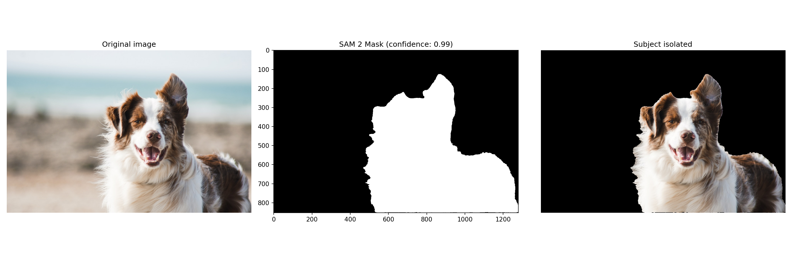
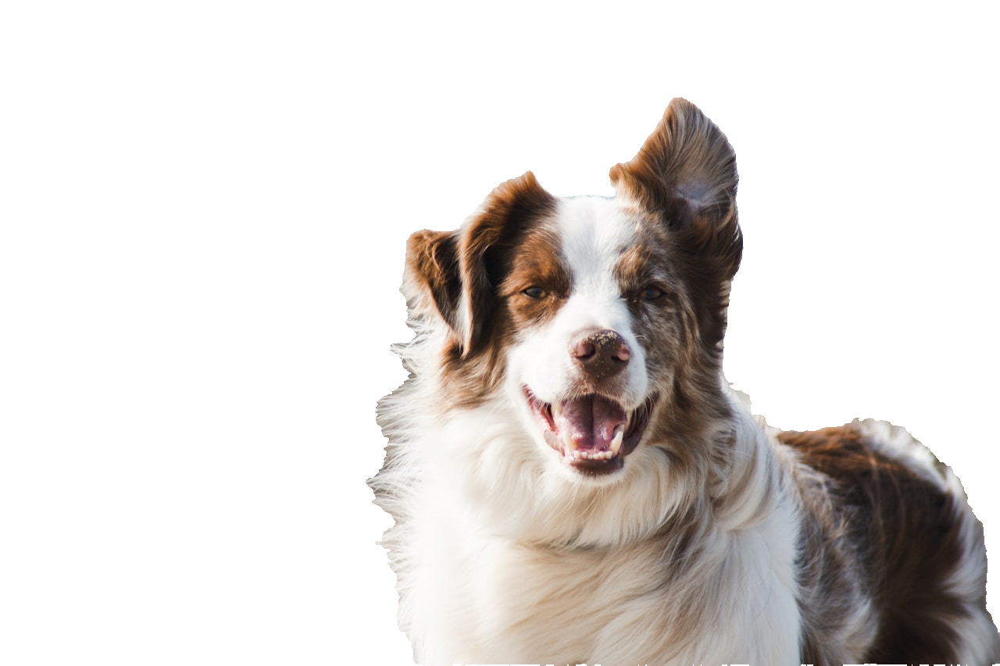

# Shotmask
Rotoscoping tool that automates VFX masking workflows 
using Meta's SAM 2. Reduces manual rotoscoping from hours to minutes..

## Status
In active development — June 2026

### Progress
- [x] Frame extraction pipeline (OpenCV)
- [x] SAM 2 model loading and inference
- [x] Single-frame mask generation (99%+ confidence)
- [x] Alpha channel PNG export
- [ ] Full video mask pipeline
- [ ] Gradio UI
- [ ] Hugging Face Spaces deployment

## What It Does
Upload a video → click on subject → SAM 2 automatically generates 
a precise mask for every frame → export as PNG sequence with alpha 
channel ready for Nuke or After Effects..

## First Result
SAM 2 generating a mask at 99% confidence on a test image:


Successfully exported the mask:


## Tech Stack
- **SAM 2** (Meta) — video object segmentation
- **PyTorch** — model inference on GPU
- **OpenCV** — video processing and frame extraction
- **Pillow** — PNG with alpha channel export
- **Gradio** — user interface (coming soon)

## Project Structure
````
ShotMask/
├── src/
│   ├── preprocess.py        # Video → frames extraction
│   ├── sam2_predictor.py    # SAM 2 model wrapper
│   ├── alpha_exporter.py    # Mask → PNG with alpha 
│   └── mask_generator.py    # Full video pipeline (coming soon)
├── app.py                   # Gradio UI (coming soon)
├── notebooks/
│   └── 01_sam2_test.ipynb   # Development notebook
└── examples/                # Test footage and results
````

## Running the Frame Extractor
````bash
python src/preprocess.py --video your_video.mp4 --output examples/Frames
````

## Target
Fully working tool deployed on Hugging Face Spaces by July 2026.
